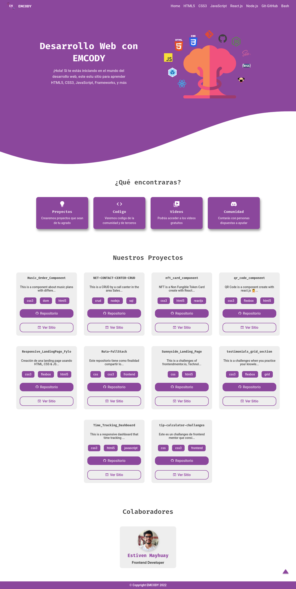
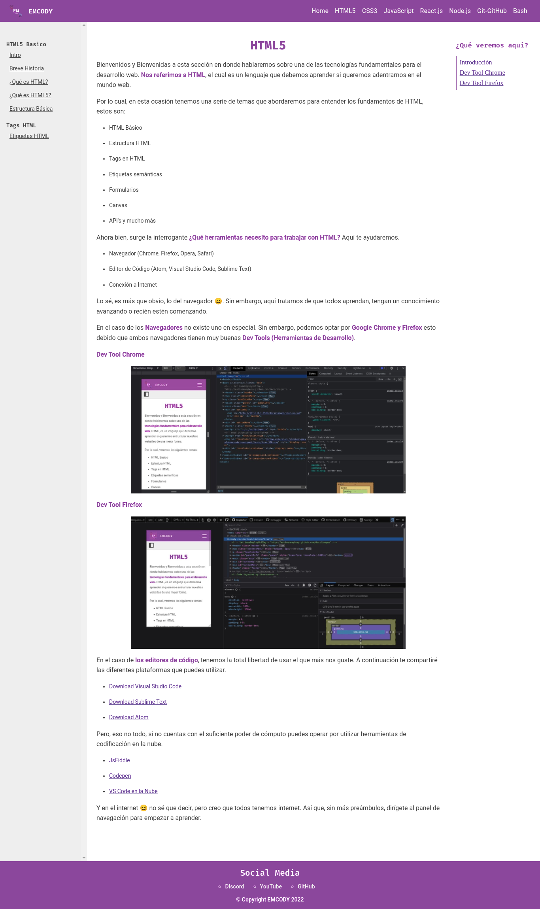

# 

## **EMCODY**

Es una plataforma web que le permite a las personas interesadas en el mundo del desarrollo web, poder aprender las tecnologías base como:

- HTML5
- Pug
- CSS3
- Sass y Less
- JavaScript
- Git & Github
- Node.js
- React.js

Buscamos llegas a más personas compartiendo lo que aprendemos y conocer lo que la comunidad tiene para ofrecer.

## **Vistas**

A continuación podrás dar un vistazo a nuestro entorno de aprendizaje.

> **Home**  **Course** 
